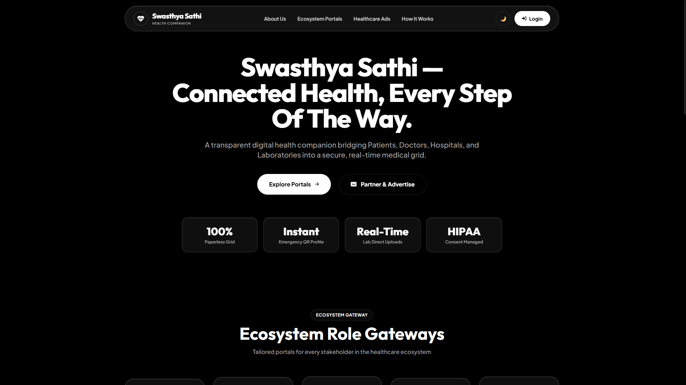
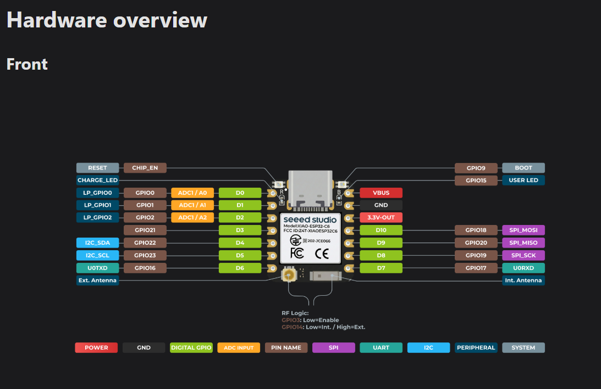
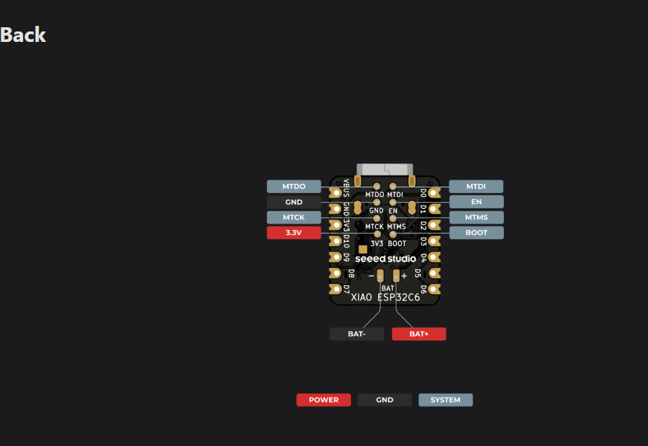
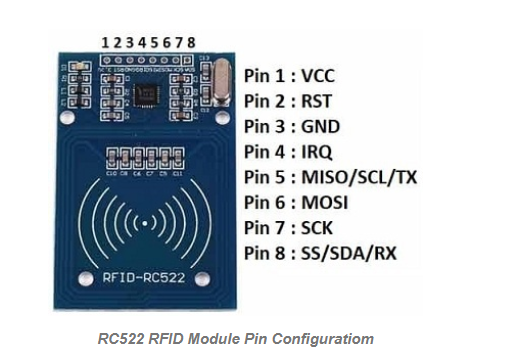
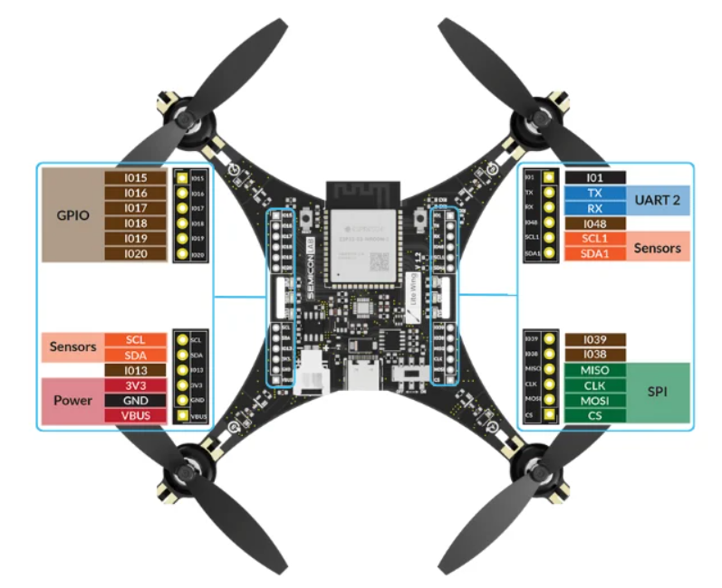

<div align="center">




# 🏥 Swasthya Sathi
### *Universal Digital Healthcare Companion — India*

> **Swasthya** (स्वास्थ्य) = Health · **Sathi** (साथी) = Companion  
> A unified digital healthcare ecosystem connecting Patients, Doctors, Hospitals, Labs, and Advertisers under one intelligent platform.

</div>

---

## 📌 Table of Contents

- [About the Project](#-about-the-project)
- [What We Are Building](#-what-we-are-building)
- [Project Structure](#-project-structure)
- [User Roles & Dashboards](#-user-roles--dashboards)
- [Tech Stack & Architecture](ARCHITECTURE.md)
- [Frontend Setup](#-frontend-setup)
- [Roadmap](#-roadmap)
- [Contributing](#-contributing)
- [Team](#-team)

---

## 🌟 About the Project

**Swasthya Sathi** is a comprehensive, role-based digital healthcare platform built for India. It bridges the gap between patients and the entire healthcare ecosystem — doctors, hospitals, diagnostic labs, and healthcare advertisers — through a single, unified web interface.

The platform is designed to work across urban and rural India, supporting multiple languages and offering an accessible, mobile-first experience.

---

## 🔨 What We Are Building

| Module | Description | Status |
|--------|-------------|--------|
| 🏠 **Landing Page** | Marketing homepage with hero, features, testimonials | ✅ Complete |
| 🔐 **Authentication** | Firebase-based login with role detection | ✅ Complete |
| 📋 **Patient Portal** | Full EHR dashboard, health timeline, reports, profile | ✅ Complete |
| 👨‍⚕️ **Doctor Dashboard** | Appointments, patient queue, prescriptions | ✅ Complete |
| 🏥 **Hospital Dashboard** | Bed management, doctor roster, OPD/IPD tracking | ✅ Complete |
| 🔬 **Lab Dashboard** | Test orders, result uploads, patient reports | ✅ Complete |
| 📢 **Advertiser Dashboard** | Ad campaign management, analytics, approval flow | ✅ Complete |
| 🛡️ **Admin Panel** | Platform-wide oversight, user management, ad moderation | ✅ Complete |
| 🚨 **Emergency Module** | Emergency responder profile & quick-access tools | ✅ Complete |
| 📝 **Registration Forms** | Role-specific onboarding for all user types | ✅ Complete |
| ⚙️ **Backend API** | FastAPI REST backend with Firebase Admin SDK | 🚧 In Progress |

---

## 📁 Project Structure

```
Swasthya_sathi/
│
├── 📂 frontend/                     # All frontend source files
│   │
│   ├── 📄 index.html                # Main landing page
│   ├── 📄 login.html                # Unified login page (all roles)
│   │
│   ├── 📂 patient/                  # Patient role portal
│   │   ├── dashboard.html           # Patient EHR dashboard (main hub)
│   │   ├── profile.html             # Personal health profile
│   │   ├── timeline.html            # Health event timeline / history
│   │   ├── upload.html              # Document & report upload
│   │   └── permissions.html         # Data sharing & consent management
│   │
│   ├── 📂 doctor/                   # Doctor role portal
│   │   └── dashboard.html           # Appointments, patients, prescriptions
│   │
│   ├── 📂 hospital/                 # Hospital administration portal
│   │   └── dashboard.html           # Beds, OPD/IPD, staff management
│   │
│   ├── 📂 lab/                      # Diagnostic lab portal
│   │   └── dashboard.html           # Test orders, results, uploads
│   │
│   ├── 📂 admin/                    # Platform super-admin panel
│   │   └── dashboard.html           # User management, analytics, moderation
│   │
│   ├── 📂 advertiser/               # Healthcare advertiser portal
│   │   └── dashboard.html           # Campaign creation, analytics, ROI
│   │
│   ├── 📂 emergency/                # Emergency responder module
│   │   └── profile.html             # Responder ID card, quick access
│   │
│   ├── 📂 register/                 # Role-specific registration forms
│   │   ├── patient.html             # Patient onboarding form
│   │   ├── doctor.html              # Doctor verification form
│   │   ├── hospital.html            # Hospital registration form
│   │   ├── lab.html                 # Lab registration form
│   │   └── advertiser.html          # Advertiser account setup
│   │
│   ├── 📂 pharmacy/                 # Pharmacy portal
│   │   └── dashboard.html           # Pharmacy management
│   ├── 📂 css/
│   │   └── custom.css               # Global custom styles & design tokens
│   │
│   ├── 📂 js/
│   │   ├── firebase-config.js       # Firebase app initialization & exports
│   │   ├── auth-guard.js            # Route protection by role
│   │   ├── index.js                 # Landing page logic
│   │   ├── i18n.js                  # Internationalization (multi-language)
│   │   ├── utils.js                 # Shared utility functions
│   │   ├── ads-config.js            # Ad system configuration & helpers
│   │   └── supabase-config.js       # Ad storage layer (local-first fallback)
│   │
│   └── 📂 assets/                   # Static images & media
│       └── screenshot.png           # Website landing page snapshot
│
├── 📂 hardware/                     # Drone demo & firmware files
│   ├── 📂 drone_demo/
│   └── 📂 firmware/
│
├── 📂 backend/                      # NOT pushed yet — coming in Phase 2
│   └── (FastAPI server, Firebase Admin, AI models)
│
├── 📂 scripts/                      # Utility and deployment scripts
│   ├── deploy_rules.py
│   ├── fix_appointment.py
│   └── setup_hospital_doctor.py
│
├── 📄 .gitignore
└── 📄 README.md
```

---

## 👥 User Roles & Dashboards

### 🧑‍💼 Patient
The heart of the platform. Each patient gets a **personal health record (PHR/EHR)** that they own and control:
- View & manage all medical records, prescriptions, lab reports
- Health timeline showing life events chronologically
- Share records with doctors/hospitals with granular permissions
- Upload documents (PDFs, images, scan reports)
- Emergency ID card with critical health info

### 👨‍⚕️ Doctor
- View today's appointment queue
- Access patient-shared records
- Write digital prescriptions
- Manage availability & schedule

### 🏥 Hospital
- Real-time bed availability tracking (General / ICU / Emergency)
- OPD & IPD patient management
- Doctor roster management
- Department-wise analytics

### 🔬 Diagnostic Lab
- Receive and manage test orders
- Upload & deliver reports digitally
- Track pending vs. completed tests

### 📢 Advertiser (Healthcare Brands)
- Submit targeted healthcare ad campaigns
- Choose placement zones (hero, sidebar, card)
- View impression & click analytics
- Campaign approval/rejection workflow

### 🛡️ Admin
- Full platform oversight
- User verification and role management
- Ad campaign moderation (approve / reject)
- System-wide analytics

---

## 🛠️ Tech Stack & Architecture

> 📖 For an in-depth breakdown of the technical design, data flows, and security model, view the full [**ARCHITECTURE.md**](ARCHITECTURE.md) document.
| Technology | Purpose |
|---|---|
| **HTML5 / CSS3 / JavaScript** | Core structure, style, and logic |
| **Tailwind CSS** (CDN) | Utility-first styling framework |
| **Font Awesome 6** | Icon library |
| **Google Fonts** (Outfit + Plus Jakarta Sans) | Typography |
| **Firebase JS SDK v10** | Authentication + Firestore real-time DB |

### Backend *(Phase 2 — Coming Soon)*
| Technology | Purpose |
|---|---|
| **FastAPI** (Python) | REST API server |
| **Firebase Admin SDK** | Server-side auth verification |
| **Firestore** | Primary database |
| **Local File Storage** | Image/document storage (Phase 1) |

---

## 🔌 Hardware Architecture & Pinouts

Swasthya Sathi integrates cutting-edge IoT and robotics hardware to bridge the gap between digital management and physical healthcare logistics.

### 1. Smart Queue Management (RFID System)
We use the **Seeed Studio XIAO ESP32C6** paired with an **RC522 RFID Module** to create a seamless, touchless token scanning system for the OPD.

<div align="center">
  
  
</div>

* **XIAO ESP32C6**: Chosen for its ultra-compact size, Wi-Fi 6, and Bluetooth 5 (LE) capabilities. The front pinout maps our I2C and SPI peripherals, while the back pinout provides direct access to battery management (BAT+/BAT-) for portable queue kiosks.

<div align="center">
  
</div>

* **RC522 RFID Module**: Interfaced via SPI (MOSI, MISO, SCK, SDA/SS). When a patient scans their physical token, the ESP32C6 instantly queries the Firebase backend to update their queue status on the Doctor's Dashboard.

### 2. Medical Supply Drone Delivery
For rapid, autonomous delivery of critical supplies (blood, emergency meds), we utilize a custom drone flight controller based on the **ESP32-S3-WROOM-1**.

<div align="center">
  
</div>

* **Lite Wing V1.2 Flight Controller**: 
  * **GPIO & PWM**: Mapped to the four ESCs for quadcopter motor control.
  * **Sensors (I2C)**: Dedicated SDA/SCL lines for the IMU (Gyro/Accelerometer) and Barometer for stable flight.
  * **UART 2 & SPI**: Used for GPS telemetry and long-range radio communication to track the drone directly from the Swasthya Sathi Hospital Dashboard.

---

## 🚀 Frontend Setup

The frontend is **zero-dependency** — no build tools, no npm install required.

### Option 1 — Open directly
```bash
# Just open index.html in your browser
# Or use VS Code Live Server extension
```

### Option 2 — Simple local server
```bash
# Python 3
cd frontend
python -m http.server 8080

# Then open: http://localhost:8080
```

### Option 3 — Node http-server
```bash
npx http-server frontend -p 8080
```

### Firebase Setup
The project uses Firebase for authentication. To run with your own Firebase project:
1. Create a project at [Firebase Console](https://console.firebase.google.com)
2. Enable **Email/Password Authentication**
3. Enable **Firestore Database**
4. Copy your config into `frontend/js/firebase-config.js`

---

## 🗺️ Roadmap

### Phase 1 — Frontend MVP (Current)
- [x] Landing page & branding
- [x] Login & registration for all roles
- [x] All 6 role dashboards
- [x] Patient EHR with health timeline
- [x] Multi-language support framework (i18n)
- [x] Ad system with moderation workflow
- [x] Emergency profile module
- [x] Firebase Authentication integration

### Phase 2 — Backend Integration
- [ ] FastAPI REST backend
- [ ] Firebase Admin SDK for server-side auth
- [ ] Real Firestore data persistence
- [ ] File upload API (prescriptions, reports, scan images)
- [ ] Doctor appointment booking flow
- [ ] Notification system (in-app + email)

### Phase 3 — AI & Advanced Features
- [ ] AI-powered health report summarization
- [ ] Symptom checker chatbot
- [ ] Smart appointment recommendations
- [ ] Predictive health insights

---

## 🤝 Contributing

This project is currently in active development. If you'd like to contribute:

1. Fork the repository
2. Create a feature branch: `git checkout -b feature/your-feature-name`
3. Commit your changes: `git commit -m 'feat: add your feature'`
4. Push to the branch: `git push origin feature/your-feature-name`
5. Open a Pull Request

### Commit Convention
We follow [Conventional Commits](https://www.conventionalcommits.org/):
```
feat: new feature
fix: bug fix
docs: documentation update
style: formatting, no logic change
refactor: code restructuring
```

---

## 👨‍💻 Team

| Name | Role |
|------|------|
| **Rochak** | Founder & Lead Developer |

---

<div align="center">

Made with heart in India — for India's healthcare future

*Swasthya Sathi — स्वास्थ्य साथी*

</div>
